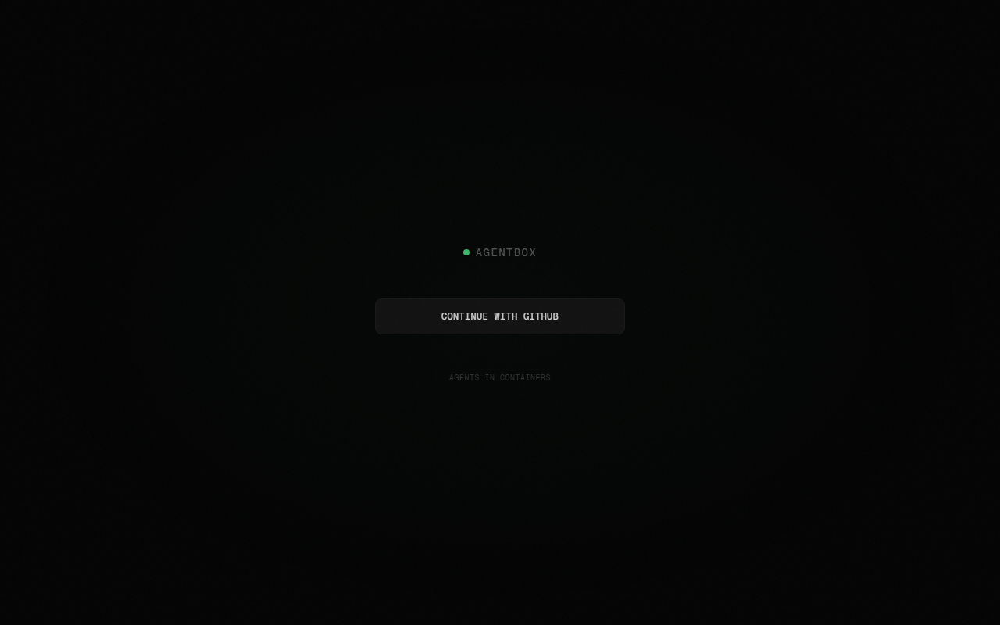
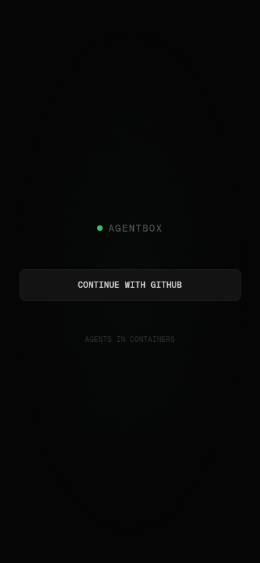

# AgentBox

AI agents in containers. Chat with them, watch them work, trigger them from GitHub.

<p align="center">
  
</p>

<p align="center">
  
</p>

```
┌─────────────┐         ┌──────────────┐         ┌──────────────────┐
│ Auth         │────────▶│ Shared Token │◀────────│ Agent Containers │
│ Container    │  sync   │   (volume)   │   r/o   │                  │
│              │         └──────────────┘         │ Ubuntu 24.04     │
│ You log in   │                                  │ Claude Code      │
│ once here    │                                  │ Chromium          │
└─────────────┘                                   │ Desktop (noVNC)  │
                                                  │ Playwright       │
                    ┌──────────────┐              │ mem0 memory      │
                    │  Web UI      │──────────────│ Desktop Control  │
                    │  :3333       │  manages via  └──────────────────┘
                    │              │  Docker API
                    │  GitHub OAuth│
                    └──────┬───────┘
                           │
                    ┌──────┴───────┐
                    │  FalkorDB    │
                    │  Graph Memory│
                    └──────────────┘
```

## What is this

A simple platform to run persistent AI coding agents in Docker containers. Each agent gets:

- **Full Ubuntu desktop** you can watch via noVNC
- **Claude Code** with your subscription auth (no API key needed)
- **Browser automation** via Playwright MCP
- **Desktop control** — screenshots, mouse, keyboard, clipboard (17 MCP tools)
- **Persistent memory** — mem0 (per-agent) + FalkorDB (graph memory)
- **GitHub triggers** — issues, PRs, pushes, `@agentbox` mentions

## Features

**Web Dashboard** — mobile-first, responsive
- Mobile: native app feel with bottom tab navigation
- Desktop: sidebar + split pane layout
- Auth terminal built-in — log into Claude from the browser

**Three views per agent:**
- **Chat** — talk to Claude Code, streaming responses
- **Terminal** — full bash shell via xterm.js
- **Desktop** — watch the agent's screen via noVNC

**Triggers:**
- GitHub webhooks (auto-installed per repo)
- GitHub Actions workflow (auto-pushed to repos)
- Cron jobs (configurable from dashboard)
- Manual chat

**Auth:**
- One auth container holds your Claude subscription credentials
- Only the access token is shared to agents (no refresh token)
- Token refresh happens automatically in the auth container
- All agents share the same subscription

## Quick Start

```bash
# Clone
git clone https://github.com/NodeNestor/AgentBox.git
cd AgentBox

# Configure
cp web/.env.example .env
# Edit .env with your GitHub OAuth App credentials

# Build and run
docker compose up -d

# Log into Claude (one time)
docker exec -it agentbox-auth claude login

# Open dashboard
open http://localhost:3333
```

## Setup

### 1. GitHub OAuth App

Create a GitHub OAuth App at `github.com/settings/developers`:
- **Homepage URL**: `http://localhost:3333`
- **Callback URL**: `http://localhost:3333/api/auth/callback/github`

Add the credentials to `.env`:
```
GITHUB_ID=your_client_id
GITHUB_SECRET=your_client_secret
```

### 2. Org restriction (optional)

To limit access to a specific GitHub org:
```
ALLOWED_ORG=your-org-name
GITHUB_TOKEN=ghp_xxx  # needs read:org scope
```

### 3. Claude Auth

The auth container manages your Claude subscription:

```bash
docker exec -it agentbox-auth claude login
```

Or use the **Auth** tab in the web dashboard.

The auth container:
- Holds the full credentials (including refresh token)
- Only shares the access token with agent containers
- Auto-refreshes tokens before expiry
- Syncs every 15 seconds

### 4. Connect repos

Click **Connect** on any repo in the dashboard. AgentBox automatically:
1. Pushes `.github/workflows/agentbox.yml` to the repo
2. Creates a webhook pointing to your AgentBox instance

Mention `@agentbox` in any issue or PR comment to trigger an agent.

## Architecture

```
docker-compose.yml
├── auth          — Claude subscription auth + token sync
├── web           — Next.js dashboard + auth terminal WebSocket
├── falkordb      — Graph memory database (Graphiti backend)
└── agent-template — Builds the agent container image

Agent containers are created dynamically from the dashboard.
Each agent gets:
├── /root/.claude-auth    — Read-only access token from auth container
├── /root/.claude-local   — Writable Claude config + MCP settings
├── /agent-memory         — Persistent mem0 storage (named volume)
├── /workspace            — Working directory
└── MCP servers:
    ├── desktop-control   — xdotool/scrot/xclip (17 tools)
    └── playwright        — Browser automation
```

## Stack

| Layer | Tech |
|-------|------|
| Web | Next.js 15, React 19, Tailwind 4 |
| Auth | NextAuth v5, GitHub OAuth |
| Container mgmt | Dockerode, Docker socket |
| Terminal | xterm.js, WebSocket, node-pty |
| Desktop | Xvfb, x11vnc, noVNC, Openbox |
| Browser | Chromium, Playwright MCP |
| Desktop control | xdotool, scrot, xclip, wmctrl |
| Memory | mem0 (SQLite), FalkorDB (graph) |
| Agent | Claude Code (subscription auth) |

## Ports

| Port | Service |
|------|---------|
| 3333 | Web dashboard |
| 3334 | Auth terminal WebSocket |
| 9090 | Auth container health API |
| 6379 | FalkorDB |

Agent containers get random ports assigned for VNC (5900), noVNC (6080), and API (8080).

## Design

Dark theme, monospace everything (Geist Mono). Two completely different layouts:

**Mobile** — native app feel
- Bottom tab bar (Agents / Repos / Cron / Auth)
- Full-screen views per tab
- Slide-up animations, backdrop blur nav
- Safe area support (notch phones)

**Desktop** — workstation feel
- Left sidebar with agent list
- Split pane agent view (chat left, terminal/desktop right)
- Collapsible auth terminal in sidebar
- Staggered fade-in animations

## License

MIT
